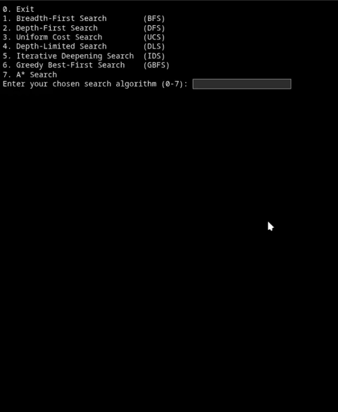

# 8-Puzzle Solver

This project is a simple implementation of the **8-puzzle problem** using Python.
<br>It solves a given puzzle by finding a sequence of moves that leads to the goal state.

---

## Demo


---

## Overview

The **8-puzzle** is a 3×3 grid with 8 numbered tiles and one empty space. Tiles can be moved into the empty space, and the objective is to reach a specific arrangement starting from an initial configuration.

This notebook shows how the puzzle can be solved step by step using search algorithms.

---

## Features

* Solves a given 8-puzzle input
* Outputs the sequence of moves
* Shows the number of steps taken
* BFS, DFS, UCS, DLS, IDS, GBFS, and A* search algos
* No external libraries required

---

## Project Structure

```id="3x9k2v"
8puzzle-solver/
├── README.md
└── src
    └── main.ipynb      # Main notebook containing the solver
```

---

## How to Run

Open the notebook and run all cells.

You can use:

* Google Colab
* Jupyter Notebook
* VS Code

---

## Example

Input: initial puzzle state
Output:

* Steps to solve the puzzle
* Final solution path

---

## Uploader

Submitted by **@zionabyrke**
